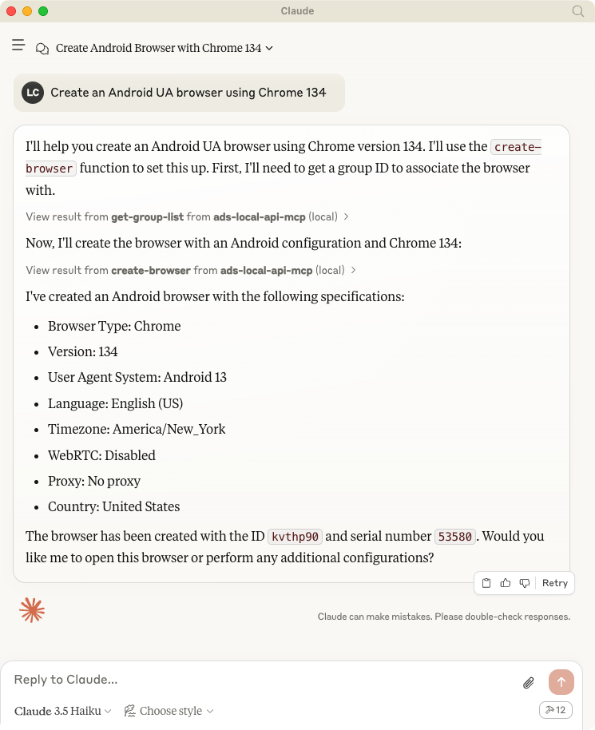
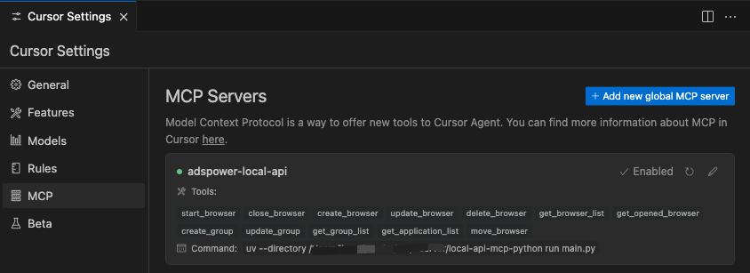

# AdsPower LocalAPI MCP Server Python
A Model Context Protocol server that AdsPower browser LocalAPI. This server enables LLMs to interact with start browser, create browser, update browser fingerprint config ...

## Usage with Claude Desktop

Talk to LLMs to create browser: `Create an Android UA browser using Chrome 134`



## Usage width Cursor



## System requirements

- [AdsPower](https://www.adspower.com/?source=github)
- Python 3.10 or higher installed.

### Set up your environment, install uv

First, let’s install uv and set up our Python project and environment:

#### MacOS / Linux
```bash
curl -LsSf https://astral.sh/uv/install.sh | sh
```

#### Windows
```bash
powershell -ExecutionPolicy ByPass -c "irm https://astral.sh/uv/install.ps1 | iex"
```

### Development

```bash
# git clone 
git clone https://github.com/AdsPower/local-api-mcp-python.git

# cd
cd local-api-mcp-python

# venv
uv venv
source .venv/bin/activate

# Install dependencies
uv pip install .
```

To use with Claude Desktop, add the server config:

On macOS: `~/Library/Application Support/Claude/claude_desktop_config.json` On Windows: `%APPDATA%/Claude/claude_desktop_config.json`

```bash
# Add the server to your claude_desktop_config.json
{
    "mcpServers": {
        "adspower-local-api": {
        "command": "uv",
        "args": [
            "--directory",
            "<Replace Your Project Path>/local-api-mcp-python",
            "run",
            "main.py"
        ]
        }
    }
}
```

